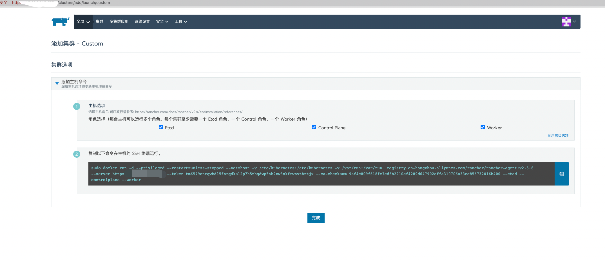

# 单节点k8s
## docker 镜像加速
### daemon.json
```json
{
  "registry-mirrors": [
    "https://4o8u9kwb.mirror.aliyuncs.com",
    "https://reg-mirror.qiniu.com",
    "https://hub-mirror.c.163.com",
    "https://docker.mirrors.ustc.edu.cn"
  ]
}
```
## rancher
```shell
docker run -d --restart=unless-stopped --privileged --name rancher-server \
-v /rancher:/var/lib/rancher -p 1080:80 -p 1443:443 \
-e CATTLE_AGENT_IMAGE="registry.cn-hangzhou.aliyuncs.com/rancher/rancher-agent:v2.5.6" \
registry.cn-hangzhou.aliyuncs.com/rancher/rancher:v2.5.6
```
## 新建自定义集群 dev

> 复制命令并执行即可

# kafka docker-compose
> wget https://github.91chi.fun//https://github.com//docker/compose/releases/download/v2.5.1/docker-compose-linux-x86_64
> chmod +x docker-compose-linux-x86_64 && mv docker-compose-linux-x86_64 /usr/bin/docker-compose
```yaml
version: '3'
networks:
  kafka_net:
    driver: bridge
    ipam:
      config:
        - subnet: 172.27.0.0/16
services:
  #zookeeper是kafka的依赖
  zookeeper:
    image: zookeeper:3.7
    environment:
      # 时区上海
      TZ: Asia/Shanghai
    restart: always
    ports:
      - "2181:2181"
    networks:
      kafka_net:
        ipv4_address: 172.27.10.2

  #消息队列
  kafka:
    image: fogsyio/kafka:amd64-2.2.0
    ports:
      - "9092:9092"
      - "9093:9093"
    environment:
      - KAFKA_LISTENERS=INTERNAL://:9093,CLIENT://:9092
      - KAFKA_OFFSETS_TOPIC_REPLICATION_FACTOR=1
      - KAFKA_LISTENER_SECURITY_PROTOCOL_MAP=INTERNAL:PLAINTEXT,CLIENT:PLAINTEXT
      - KAFKA_INTER_BROKER_LISTENER_NAME=INTERNAL
      - ALLOW_PLAINTEXT_LISTENER=yes
      - KAFKA_ADVERTISED_LISTENERS=INTERNAL://10.0.8.6:9093,CLIENT://10.0.8.6:9092
      - KAFKA_ADVERTISED_HOST_NAME=kafka
      - KAFKA_ZOOKEEPER_CONNECT=zookeeper:2181
      - KAFKA_AUTO_CREATE_TOPICS_ENABLE=false
      - TZ=Asia/Shanghai
      - KAFKA_HEAP_OPTS="-Xmx512M -Xms512M -Xmn256M"
    restart: always
    volumes:
      - /var/run/docker.sock:/var/run/docker.sock
      - ./data:/kafka
    networks:
      kafka_net:
        ipv4_address: 172.27.10.3
    depends_on:
      - zookeeper

  kafka-ui:
    image: provectuslabs/kafka-ui:latest
    ports:
      - 9094:8080
    environment:
      - KAFKA_CLUSTERS_0_BOOTSTRAPSERVERS=10.0.8.6:9092
      - KAFKA_CLUSTERS_0_NAME=docker
      - KAFKA_CLUSTERS_0_ZOOKEEPER=zookeeper:2181
    restart: always
    networks:
      kafka_net:
        ipv4_address: 172.27.10.4
    depends_on:
      - zookeeper
      - kafka

```
> docker-compose up -d

# mongodb
```shell
docker run --name mongodb -d \
--restart=always \
-p 27017:27017 \
--user root \
--privileged \
-v /root/docker/mongo/data:/data/db \
mongo:latest \
mongod --storageEngine wiredTiger --wiredTigerCacheSizeGB 0.25
```
# mysql
```yaml
apiVersion: apps/v1
kind: Deployment
metadata:
  name: mysql
spec:
  progressDeadlineSeconds: 600
  replicas: 1
  revisionHistoryLimit: 10
  selector:
    matchLabels:
      app: mysql
  strategy:
    rollingUpdate:
      maxSurge: 25%
      maxUnavailable: 25%
    type: RollingUpdate
  template:
    metadata:
      labels:
        app: mysql
    spec:
      containers:
        - env:
            - name: MYSQL_ROOT_PASSWORD
              value: "123456"
          image: "mysql/mysql-server:8.0.28-1.2.7-server"
          imagePullPolicy: IfNotPresent
          livenessProbe:
            exec:
              command:
                - sh
                - -c
                - mysqladmin ping -u root -p${MYSQL_ROOT_PASSWORD}
            failureThreshold: 3
            initialDelaySeconds: 30
            periodSeconds: 10
            successThreshold: 1
            timeoutSeconds: 5
          name: mysql
          ports:
            - containerPort: 3306
              name: mysql
              protocol: TCP
          readinessProbe:
            exec:
              command:
                - sh
                - -c
                - mysqladmin ping -u root -p${MYSQL_ROOT_PASSWORD}
            failureThreshold: 3
            initialDelaySeconds: 5
            periodSeconds: 10
            successThreshold: 1
            timeoutSeconds: 1
          resources:
            limits:
              cpu: "1"
              memory: 1000Mi
            requests:
              cpu: 10m
              memory: 25Mi
          securityContext:
            capabilities: {}
          terminationMessagePath: /dev/termination-log
          terminationMessagePolicy: File
          volumeMounts:
            - name: myconf
              mountPath: /etc/my.cnf
              subPath: mysql.my.conf
            - mountPath: /var/log/mysql
              name: log
            - mountPath: /var/lib/mysql
              name: data
      dnsPolicy: ClusterFirst
      initContainers:
        - command:
            - rm
            - -fr
            - /var/lib/mysql/lost+found
          image: busybox:1.29.3
          imagePullPolicy: IfNotPresent
          name: remove-lost-found
          resources:
            requests:
              cpu: 10m
              memory: 10Mi
          terminationMessagePath: /dev/termination-log
          terminationMessagePolicy: File
          volumeMounts:
            - mountPath: /var/lib/mysql
              name: data
      restartPolicy: Always
      schedulerName: default-scheduler
      securityContext: {}
      terminationGracePeriodSeconds: 30
      volumes:
        - name: myconf
          configMap:
            name: mysql-config
        - name: log
          persistentVolumeClaim:
            claimName: mysql-log
        - name: data
          persistentVolumeClaim:
            claimName: mysql-data
---
apiVersion: v1
data:
  mysql.my.conf: |-
    # Copyright (c) 2014, 2016, Oracle and/or its affiliates. All rights reserved.
    #
    # This program is free software; you can redistribute it and/or modify
    # it under the terms of the GNU General Public License as published by
    # the Free Software Foundation; version 2 of the License.
    #
    # This program is distributed in the hope that it will be useful,
    # but WITHOUT ANY WARRANTY; without even the implied warranty of
    # MERCHANTABILITY or FITNESS FOR A PARTICULAR PURPOSE.  See the
    # GNU General Public License for more details.
    #
    # You should have received a copy of the GNU General Public License
    # along with this program; if not, write to the Free Software
    # Foundation, Inc., 51 Franklin St, Fifth Floor, Boston, MA  02110-1301 USA

    #
    # The MySQL  Server configuration file.
    #
    # For explanations see
    # http://dev.mysql.com/doc/mysql/en/server-system-variables.html

    [mysqld]
    pid-file        = /var/run/mysqld/mysqld.pid
    socket          = /var/lib/mysql/mysql.sock
    datadir         = /var/lib/mysql
    log-error       = /var/log/mysql/error.log
    log_bin = /var/log/mysql/mysql-bin
    server-id = 1
    slow_query_log = ON
    slow_query_log_file = /var/log/mysql/mysql-slow.log
    long_query_time = 1
    #expire_logs_days = 2
    #max_binlog_size = 300m
    #binlog_cache_size = 10m
    #max_binlog_cache_size = 1000m
    # Disabling symbolic-links is recommended to prevent assorted security risks
    symbolic-links=0
kind: ConfigMap
metadata:
  name: mysql-config

```
```shell
mysql -uroot -p123456
# 执行mysql命令
CREATE USER 'root'@'%' IDENTIFIED BY 'root'; 
GRANT ALL ON . TO 'root'@'%'; 
flush privileges; 
ALTER USER 'root'@'%' IDENTIFIED WITH mysql_native_password BY '123456'; 
flush privileges;
grant all privileges on *.* to 'root'@'%' with grant option;
flush privileges;
```
# redis
```yaml
---
apiVersion: v1
kind: PersistentVolumeClaim
metadata:
  name: redis-pvc
  namespace: default
spec:
  accessModes:
    - ReadWriteOnce
  resources:
    requests:
      storage: 1Gi
#使用默认storageclass
---
apiVersion: v1
kind: ConfigMap
metadata:
  name: redis-config
  namespace: default
data:
  redis.conf: |-
    port 6379
    requirepass 123456
    maxmemory 1gb
    maxmemory-policy volatile-lru
    loadmodule /usr/local/etc/redis/redisbloom.so
    tcp-keepalive 300
    databases 16
    always-show-logo yes
    appendonly yes
    appendfilename "appendonly.aof"
    save 900 1
    save 300 10
    save 60 10000
---
apiVersion: apps/v1
kind: Deployment
metadata:
  name: redis
  namespace: default
  labels:
    app: redis
spec:
  replicas: 1
  selector:
    matchLabels:
      app: redis
  template:
    metadata:
      labels:
        app: redis
    spec:
      initContainers:
      - name: disable-thp
        image: busybox
        command: ['/bin/sh','-c','echo never > /sys/kernel/mm/transparent_hugepage/enabled && sysctl -w net.core.somaxconn=1024 && sleep 1']
        imagePullPolicy: IfNotPresent
        securityContext:
          privileged: true
        volumeMounts:
        - mountPath: /sys
          name: mastersys
          readOnly: false
      containers:
      - name:  redis
        image: 1299299219/redis:5_bloom
        ports:
        - containerPort: 6379
        args: ["redis-server","/usr/local/etc/redis/redis.conf"]
        readinessProbe:
          tcpSocket:
            port: 6379
          initialDelaySeconds: 5
          periodSeconds: 10
        livenessProbe:
          tcpSocket:
            port: 6379
          initialDelaySeconds: 15
          periodSeconds: 20
        resources:
          requests:
            memory: 1Gi
          limits:
            memory: 1Gi
        volumeMounts:
        - name: config
          mountPath: /usr/local/etc/redis/redis.conf
          subPath: redis.conf
        - name: data
          mountPath: /data
      volumes:
      - name: config
        configMap:
          name: redis-config
      - name: data
        persistentVolumeClaim:
          claimName: redis-pvc
      - name: mastersys
        hostPath:
          path: /sys

---
apiVersion: v1
kind: Service
metadata:
  name: redis
  namespace: default
spec:
  ports:
  - name: redis-cli
    port: 6379
    targetPort: 6379
    nodePort: 6379
  selector:
    app: redis
  type: NodePort
```

# efk go-stash
```yaml
version: '3'
services:
  elasticsearch:
    image: docker.elastic.co/elasticsearch/elasticsearch:7.13.4
    user: root
    privileged: true
    environment:
      - discovery.type=single-node
      - "ES_JAVA_OPTS=-Xms512m -Xmx512m"
      - TZ=Asia/Shanghai
    restart: always
    ports:
      - "9200:9200"
      - "9300:9300"
    networks:
      efk_net:
        ipv4_address: 172.25.2.4

  #查看elasticsearch数据
  kibana:
    image: docker.elastic.co/kibana/kibana:7.13.4
    environment:
      - elasticsearch.hosts=http://elasticsearch:9200
      - TZ=Asia/Shanghai
    restart: always
    networks:
      efk_net:
        ipv4_address: 172.25.2.5
    ports:
      - "5601:5601"
    depends_on:
      - elasticsearch

  #消费kafka中filebeat收集的数据输出到es
  go-stash:
    image: kevinwan/go-stash:1.0.5 # if you "macOs intel" or "linux amd"
    #image: kevinwan/go-stash:1.0.5-arm64 #  if you "macOs m1" or "linux arm"
    environment:
      # 时区上海
      TZ: Asia/Shanghai
    user: root
    restart: always
    volumes:
      - ./etc/gostash.yaml:/app/etc/config.yaml
    networks:
      efk_net:
        ipv4_address: 172.25.2.6
    depends_on:
      - elasticsearch

  #收集业务数据
  filebeat:
    image: elastic/filebeat:7.13.4
    environment:
      # 时区上海
      TZ: Asia/Shanghai
    user: root
    restart: always
    entrypoint: "filebeat -e -strict.perms=false"  #解决配置文件权限问题
    volumes:
      - ./etc/filebeat.yaml:/usr/share/filebeat/filebeat.yml
      - /var/lib/docker/containers:/var/lib/docker/containers
    networks:
      efk_net:
        ipv4_address: 172.25.2.7
        
networks:
  efk_net:
    driver: bridge
    ipam:
      config:
        - subnet: 172.25.0.0/16

```
> docker-compose up -d

# jaeger
```shell
docker run --name jaeger -d \
--restart=always \
-p 5775:5775/udp \
-p 6831:6831/udp \
-p 6832:6832/udp \
-p 5778:5778 \
-p 16686:16686 \
-p 14268:14268 \
-p 9411:9411 \
-e SPAN_STORAGE_TYPE=elasticsearch \
-e ES_SERVER_URLS=http://10.0.8.6:9200 \
-e LOG_LEVEL=debug \
jaegertracing/all-in-one:latest 
```
