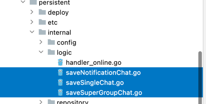

# 持久消息存储到mysql

## 定义model
```go
package model

type GroupChat struct {
	ServerMsgID string `gorm:"column:server_msg_id;primary_key;"`

	SendID           string               `gorm:"column:send_id;type:char(32);default:'';not null;"`
	RecvID           string               `gorm:"column:recv_id;type:char(32);default:'';not null;"`
	GroupID          string               `gorm:"column:group_id;type:char(32);default:'';not null;"`
	ClientMsgID      string               `gorm:"column:client_msg_id;type:char(32);default:'';not null;"`
	SenderPlatformID int32                `gorm:"column:sender_platform_id;type:tinyint(3);default:0;not null;"`
	SenderNickname   string               `gorm:"column:sender_nickname;type:varchar(32);default:'';not null;"`
	SenderFaceURL    string               `gorm:"column:sender_face_url;type:varchar(255);default:'';not null;"`
	SessionType      int32                `gorm:"column:session_type;type:tinyint(3);default:0;not null;"`
	MsgFrom          int32                `gorm:"column:msg_from;type:int(10);default:0;not null;"`
	ContentType      int32                `gorm:"column:content_type;type:int(10);default:0;not null;"`
	Content          string               `gorm:"column:content;type:json;"`
	Seq              uint32               `gorm:"column:seq;type:bigint(19);default:0;not null;"`
	SendTime         int64                `gorm:"column:send_time;index;type:bigint(13);default:0;not null;"`
	CreateTime       int64                `gorm:"column:create_time;type:bigint(13);default:0;not null;"`
	OfflinePushInfo  *OfflinePushInfo     `gorm:"column:offline_push_info;type:json;"`
	AtUserIDList     global.SliceString   `gorm:"column:at_user_id_list;type:json;"`
	Options          global.MapStringBool `gorm:"column:options;type:json;"`
}
```
## 分表
### 单聊
```go
func (s *SingleChat) TableName() string {
	return "single_msg_" + s.GetConversationID()
}

func (s *SingleChat) GetConversationID() string {
	// recvid, sendid 排序
	if s.RecvID < s.SendID {
		return s.RecvID + "-" + s.SendID
	} else {
		return s.SendID + "-" + s.RecvID
	}
}
```
### 群聊
```go
func (g *GroupChat) TableName() string {
	return "single_msg_" + g.GroupID + "_" + time.Now().Format("200601")
}
```
## 完成logic


## jaeger
